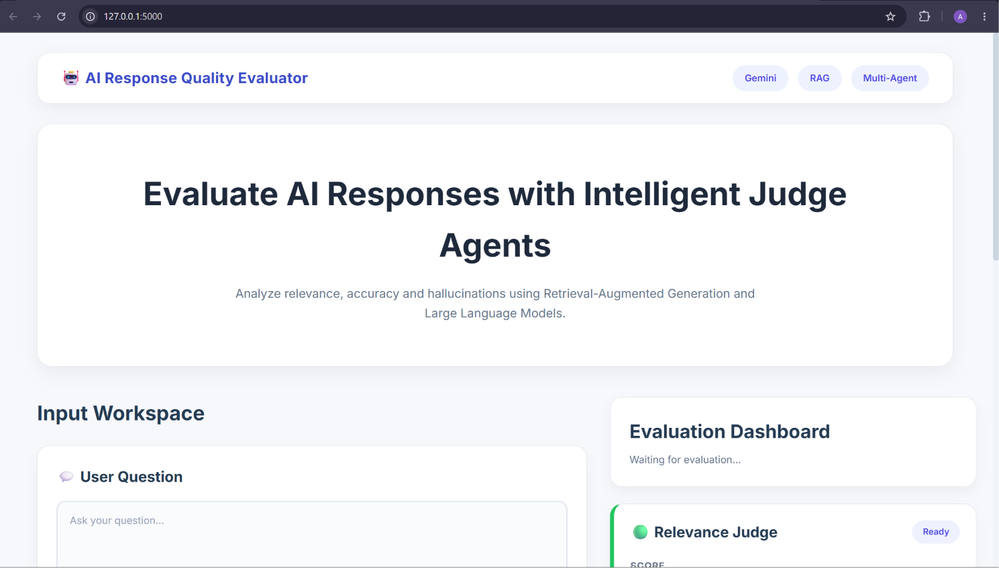
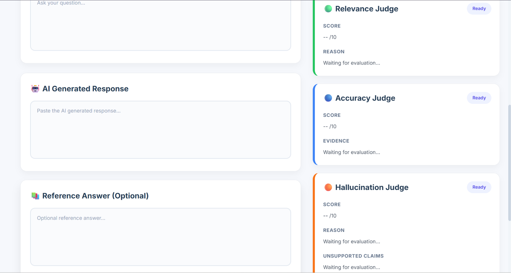

# 🤖 AI Response Quality Evaluator

> An intelligent multi-agent framework for evaluating the quality of Large Language Model (LLM) responses using Retrieval-Augmented Generation (RAG), benchmark datasets, and specialized AI judges.

<p align="center">


</p>

---

# 📖 Project Overview

Large Language Models (LLMs) such as **Gemini, ChatGPT, Claude, and Llama** are capable of generating fluent and context-aware responses. However, these responses may still suffer from issues such as:

- Hallucinated information
- Factual inaccuracies
- Irrelevant content
- Unsupported claims
- Incomplete answers

Evaluating these responses manually is subjective, time-consuming, and difficult to scale.

The **AI Response Quality Evaluator** addresses this challenge by providing an automated evaluation framework that analyzes AI-generated responses across multiple quality dimensions using specialized evaluation agents.

Instead of relying on a single evaluator, the system adopts a **multi-agent architecture** where each agent focuses on a specific aspect of response quality. The evaluation process is further strengthened through **Retrieval-Augmented Generation (RAG)**, allowing the judges to compare responses against relevant reference knowledge before producing their assessments.

To ensure objective validation, the framework also supports **benchmark-based evaluation** using datasets such as **TruthfulQA**, enabling systematic testing of the evaluator itself.

---

# ✨ Key Features

## 🌐 Web Application

- Modern Flask-based web interface
- User-friendly evaluation workspace
- Interactive evaluation dashboard
- Responsive design

---

## 🤖 Multi-Agent Evaluation

The system evaluates AI responses using three specialized judge agents:

- ✅ Relevance Judge
- ✅ Accuracy Judge
- ✅ Hallucination Judge

Each judge independently analyzes the response and produces:

- Numerical score
- Natural language explanation
- Supporting reasoning

These individual evaluations are combined into a final overall score.

---

## 📚 Retrieval-Augmented Generation (RAG)

The evaluation pipeline incorporates Retrieval-Augmented Generation by:

- Maintaining a reference knowledge base
- Retrieving relevant context
- Grounding evaluations with supporting information
- Reducing unsupported judgments

---

## 📊 Benchmark Validation Framework

Beyond manual evaluation, the project includes an automated validation framework capable of evaluating the evaluator itself using benchmark datasets.

Current capabilities include:

- Benchmark Dataset Validation
- TruthfulQA Integration
- Sequential Sampling
- Random Sampling
- Full Dataset Evaluation
- Automatic Report Generation

---

## 🧩 Modular Architecture

The project is organized into independent modules for:

- Frontend
- Backend
- Evaluation Agents
- Knowledge Retrieval
- Validation Framework
- Documentation

This modular design allows new evaluation agents and benchmark datasets to be integrated with minimal changes.

---

# 📸 Application Preview

## Homepage

The landing page provides an overview of the evaluation framework and serves as the entry point for submitting AI responses.

<p align="center">
    
</p>

---

## Evaluation Dashboard

The dashboard presents the evaluation results generated by the specialized AI judges, including individual scores, explanations, and the overall response quality assessment.

<p align="center">
    
</p>

---

# 📚 Documentation

Detailed documentation is available inside the **docs/** directory.

| Document | Description |
|----------|-------------|
| `docs/RESEARCH.md` | Research on LLM evaluation techniques, RAG, hallucination detection, and benchmark datasets. |
| `docs/SYSTEM_DESIGN.md` | Overall system architecture and component interactions. |
| `docs/AGENTS.md` | Responsibilities and workflow of each evaluation agent. |
| `docs/DATA_MODELS.md` | Data structures and information flow used throughout the project. |
| `docs/TECH_STACK.md` | Technologies, libraries, and frameworks used. |
| `docs/PROJECT_PLAN.md` | Project planning, milestones, and development roadmap. |

---

# 🛠 Technology Stack

| Category | Technology |
|-----------|------------|
| Programming Language | Python |
| Backend Framework | Flask |
| Frontend | HTML, CSS, JavaScript |
| LLM | Google Gemini |
| Retrieval | Retrieval-Augmented Generation (RAG) |
| Embeddings | Sentence Transformers |
| Vector Store | FAISS |
| Knowledge Base | JSON |
| Benchmark Dataset | TruthfulQA |
| Version Control | Git & GitHub |

---

# 🏗 System Architecture

The AI Response Quality Evaluator follows a layered architecture that separates user interaction, application logic, AI evaluation, and data management into independent layers. This modular design improves maintainability, scalability, and allows individual components to evolve independently.

<p align="center">
    
</p>

The architecture consists of four logical layers:

| Layer | Responsibility |
|--------|----------------|
| **Presentation Layer** | Provides the Flask-based web interface for user interaction and response submission. |
| **Application Layer** | Coordinates the evaluation workflow, validation framework, and report generation. |
| **Intelligence Layer** | Performs Retrieval-Augmented Generation (RAG), interacts with Gemini, and executes the specialized evaluation agents. |
| **Data Layer** | Manages the knowledge base, benchmark datasets, and generated validation reports. |


---

# 🔄 Response Evaluation Workflow

```text
                           User Input
                                │
                                ▼
                    Evaluation Input Module
                                │
                                ▼
              Retrieval-Augmented Generation (RAG)
                                │
                                ▼
                     Reference Knowledge Base
                                │
                                ▼
                  AI Response Evaluation Pipeline
                                │
        ┌───────────────────────┼────────────────────────┐
        │                       │                        │
        ▼                       ▼                        ▼
 Relevance Judge         Accuracy Judge       Hallucination Judge
        │                       │                        │
        └───────────────┬───────┴───────────────┬────────┘
                        ▼                       ▼
                 Individual Evaluation Results
                                │
                                ▼
                     Overall Response Quality
                                │
                                ▼
                  Interactive Evaluation Dashboard
```

---

# 📂 Repository Structure

```text
AI-Response-Quality-Evaluator/
│
├── docs/                          # Project documentation
│   ├── AGENTS.md
│   ├── DATA_MODELS.md
│   ├── PROJECT_PLAN.md
│   ├── RESEARCH.md
│   ├── SYSTEM_DESIGN.md
│   └── TECH_STACK.md
│
├── prototype/                     # Milestone 1 prototype
│   ├── backend/
│   ├── screenshots/
│   ├── templates/
│   ├── app.py
│   └── README.md
│
├── src/
│   ├── agents/
│   │   ├── relevance_agent.py
│   │   ├── accuracy_agent.py
│   │   └── hallucination_agent.py
│   │
│   ├── backend/
│   │   ├── evaluator.py
│   │   ├── retrieval.py
│   │   ├── llm.py
│   │   └── utils.py
│   │
│   ├── knowledge_base/
│   │   └── knowledge_base.json
│   │
│   ├── static/
│   │   ├── css/
│   │   ├── js/
│   │   └── images/
│   │
│   ├── templates/
│   │   └── index.html
│   │
│   ├── validation/
│   │   ├── datasets/
│   │   │   ├── raw/
│   │   │   ├── benchmark_data.json
│   │   │   ├── truthfulqa.json
│   │   │   └── state.json
│   │   │
│   │   ├── reports/
│   │   │   ├── benchmark_sample_report.txt
│   │   │   ├── truthfulqa_sample_report.txt
│   │   │   └── README.md
│   │   │
│   │   ├── convert_truthfulqa.py
│   │   ├── dataset_loader.py
│   │   ├── report.py
│   │   └── validator.py
│   │
│   ├── app.py
│   └── __init__.py
│
├── .gitignore
├── LICENSE
├── README.md
└── requirements.txt
```

---

# ⚙️ Installation

Clone the repository:

```bash
git clone https://github.com/abhinavgoel2005/AI-Response-Quality-Evaluator.git
```

Move into the project directory:

```bash
cd AI-Response-Quality-Evaluator
```

Install all required dependencies:

```bash
pip install -r requirements.txt
```

---

# 🔑 Environment Variables

Create a `.env` file inside the **src/** directory.

Example:

```env
GOOGLE_API_KEY=YOUR_GEMINI_API_KEY
```

The project uses **Google Gemini** for response generation and LLM-based evaluation.

---

# 🚀 Running the Web Application

Move into the source directory:

```bash
cd src
```

Start the Flask application:

```bash
python app.py
```

Open your browser and visit:

```text
http://127.0.0.1:5000
```

---

# 💡 Using the Web Interface

The web application allows users to evaluate AI-generated responses interactively.

### Step 1

Enter a **User Question**.

### Step 2

Paste the **AI Generated Response**.

### Step 3

(Optional) Provide a **Reference Answer**.

### Step 4

Click **Evaluate**.

The system will display:

- Relevance Score
- Accuracy Score
- Hallucination Score
- Overall Evaluation
- Detailed reasoning from each judge

---

# 🧪 Benchmark Validation Framework

The project includes an automated validation framework for evaluating the evaluator using benchmark datasets.

Current supported datasets include:

- Benchmark Dataset
- TruthfulQA

Move into the source directory:

```bash
cd src
```

Run the validator:

```bash
python -m validation.validator
```

The validator automatically:

- Loads benchmark samples
- Generates responses (if required)
- Runs all evaluation agents
- Computes the overall score
- Generates a detailed validation report

---

# 📄 Validation Reports

Generated reports are stored in:

```text
src/validation/reports/
```

Example reports included in the repository:

- benchmark_sample_report.txt
- truthfulqa_sample_report.txt

These reports demonstrate the output produced by the validation framework.

---

# 🎯 Evaluation Pipeline

The validation workflow follows the sequence below:

```text
Dataset
     │
     ▼
Dataset Loader
     │
     ▼
Sampling Strategy
     │
     ▼
Response Generation (Gemini)
     │
     ▼
Multi-Agent Evaluation
     │
     ├── Relevance Judge
     ├── Accuracy Judge
     └── Hallucination Judge
     │
     ▼
Overall Score
     │
     ▼
Validation Report
```

---

# 🛣 Roadmap

The project is being developed incrementally with a focus on building a reliable and explainable AI response evaluation framework.

## Completed

- [x] Flask-based Web Interface
- [x] Multi-Agent Evaluation Pipeline
- [x] Relevance Evaluation Agent
- [x] Accuracy Evaluation Agent
- [x] Hallucination Detection Agent
- [x] Retrieval-Augmented Generation (RAG)
- [x] Knowledge Base Integration
- [x] TruthfulQA Benchmark Integration
- [x] Automated Validation Framework
- [x] Sequential & Random Dataset Sampling
- [x] Automated Validation Report Generation

---

## Planned Enhancements

- [ ] Batch Evaluation Support
- [ ] Interactive Analytics Dashboard
- [ ] PDF Report Export
- [ ] Additional Benchmark Dataset Support
- [ ] Gemini SDK Migration (`google-genai`)
- [ ] REST API Endpoints
- [ ] Docker Deployment
- [ ] CI/CD Integration using GitHub Actions

---

# 📜 License

This project is licensed under the **MIT License**.

See the [LICENSE](LICENSE) file for complete details.

---

# 🙏 Acknowledgements

This project builds upon ideas, tools, and datasets provided by the open-source community.

Special thanks to:

- Google Gemini
- Flask
- LangChain
- FAISS
- Sentence Transformers
- TruthfulQA Benchmark
- Hugging Face
- RAGAS
- TruLens

---

# 👨‍💻 Author

**Abhinav Goel**

B.Tech – Artificial Intelligence & Machine Learning

Guru Gobind Singh Indraprastha University (GGSIPU)

Infosys Springboard Internship Project – 2026

GitHub:
https://github.com/abhinavgoel2005

LinkedIn:
https://www.linkedin.com/in/abhinav-pradeep-goel10

---

# ⭐ If you found this project useful...

If you found this repository helpful or interesting, consider giving it a ⭐ on GitHub.

It helps support the project and encourages future development.