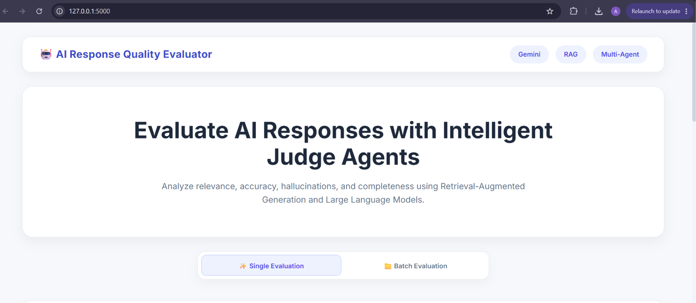
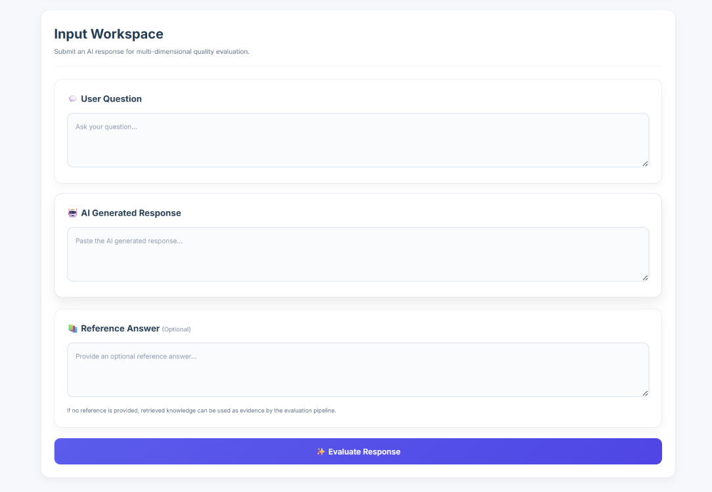
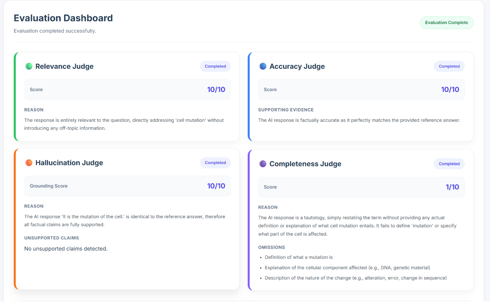
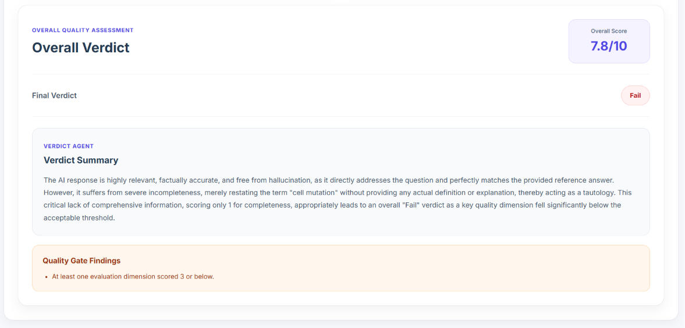
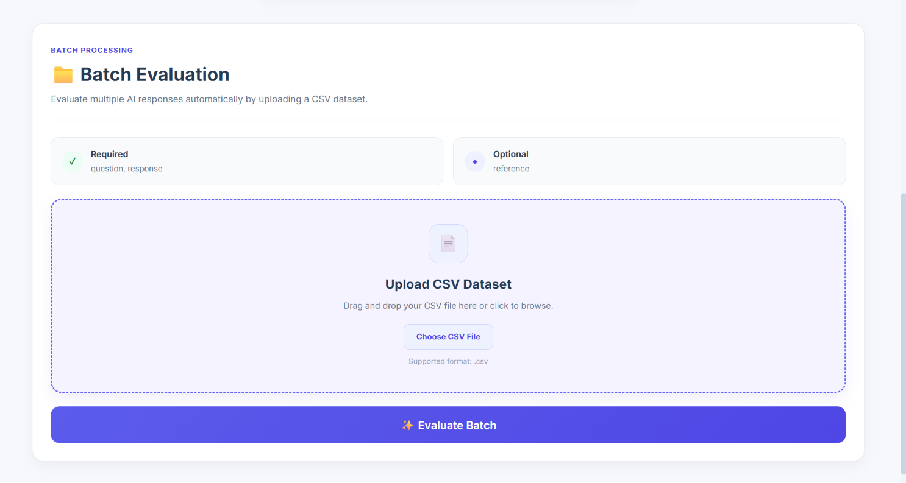
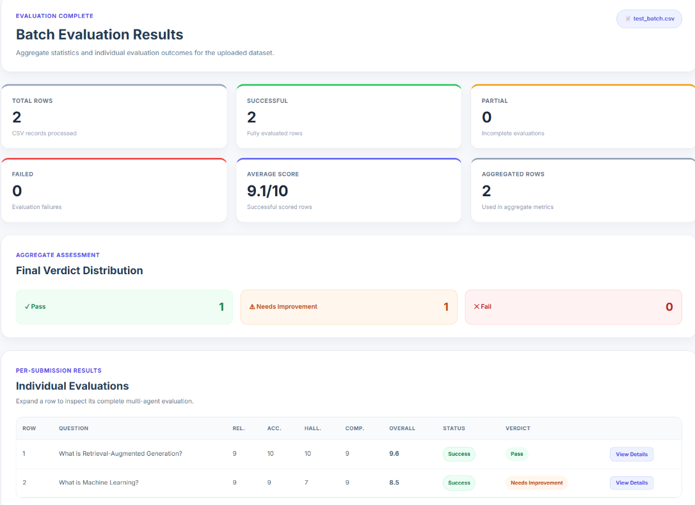
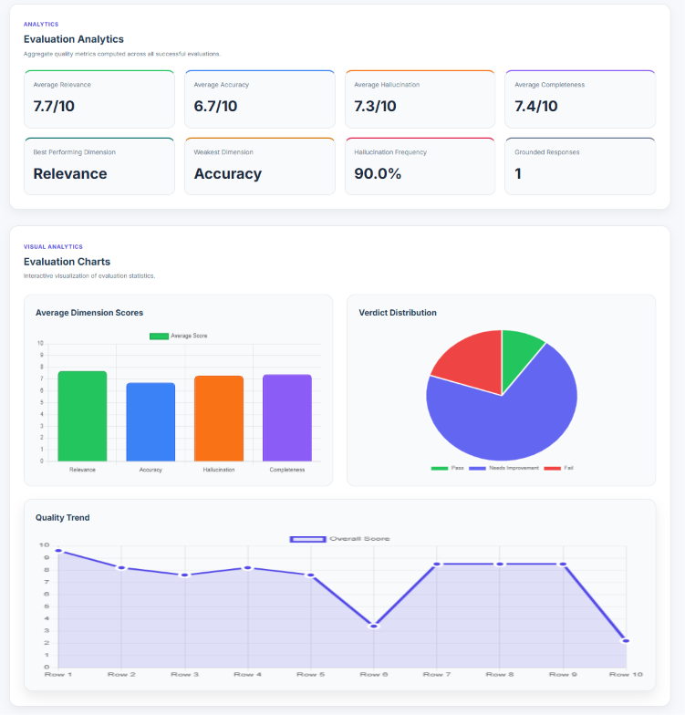
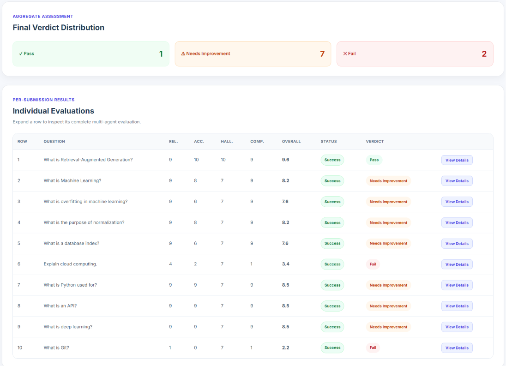
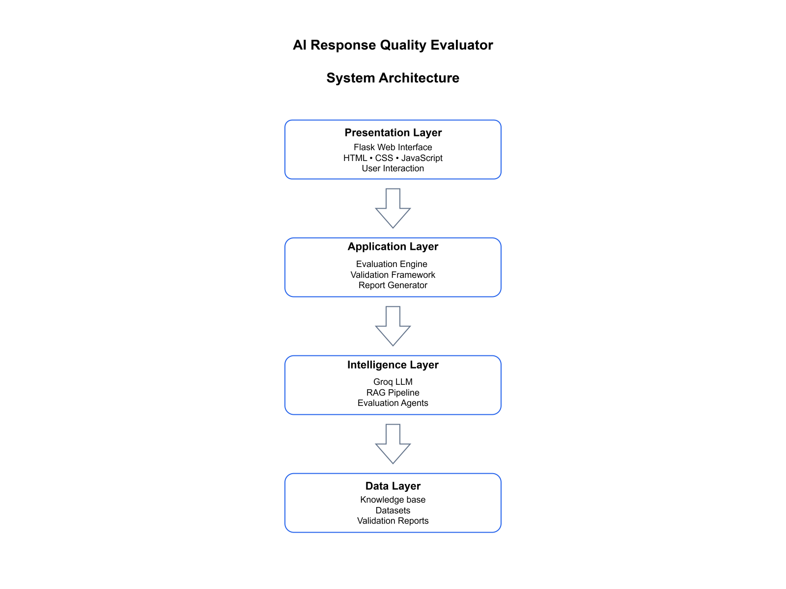

# 🤖 AI Response Quality Evaluator

>  An intelligent multi-agent system for evaluating the quality of Large Language Model (LLM) responses using Retrieval-Augmented Generation (RAG), specialized evaluation agents, batch evaluation, analytics, and automated reporting.

<p align="center">


</p>

---

# 📖 Project Overview

Large Language Models (LLMs) such as **Groq, ChatGPT, Claude, and Llama** are capable of generating fluent and context-aware responses. However, these responses may still suffer from issues such as:

- Hallucinated information
- Factual inaccuracies
- Irrelevant content
- Unsupported claims
- Incomplete answers

Evaluating these responses manually is subjective, time-consuming, and difficult to scale.

The **AI Response Quality Evaluator** addresses this challenge by providing an automated evaluation framework that analyzes AI-generated responses across multiple quality dimensions using specialized evaluation agents.

Instead of relying on a single evaluator, the system adopts a **multi-agent architecture** where each agent focuses on a specific aspect of response quality. The evaluation process is further strengthened through **Retrieval-Augmented Generation (RAG)**, allowing the judges to compare responses against relevant reference knowledge before producing their assessments.

To ensure objective validation, the framework also supports **benchmark-based evaluation** using datasets such as **TruthfulQA**, enabling systematic testing of the evaluator itself.

---

# ✨ Key Features

- 🤖 **Multi-Agent Evaluation** — Evaluates responses using specialized Relevance, Accuracy, Hallucination, and Completeness agents.
- 📚 **RAG-Based Evaluation** — Retrieves supporting evidence from a semantic knowledge base using Sentence Transformers and FAISS.
- 🎯 **Evidence-Aware Evaluation** — Accuracy and Hallucination are marked as unverifiable when suitable grounding evidence is unavailable.
- 📦 **Batch Evaluation** — Evaluate multiple question-response pairs using CSV files.
- 📊 **Evaluation Dashboard** — View scores, dimension-wise analytics, verdict distribution, trends, and evaluation statistics.
- 📄 **PDF Report Export** — Generate downloadable PDF reports for batch evaluations.
- 🧪 **End-to-End Testing** — Complete evaluation pipeline validated with 14/14 tests passed.
- 🔍 **Scoring Consistency Validation** — Validate evaluation stability across repeated executions.

---

# 🤖 Multi-Agent Evaluation

The system evaluates AI responses across four independent quality dimensions:

| Agent | Responsibility |
|---|---|
| **Relevance Agent** | Determines whether the response directly addresses the question |
| **Accuracy Agent** | Evaluates factual correctness using available evidence |
| **Hallucination Agent** | Identifies unsupported claims |
| **Completeness Agent** | Checks whether important aspects of the question are adequately covered |
| **Verdict Agent** | Consolidates all agent results into the final assessment |

The Verdict Agent produces:

- Overall score
- Final verdict
- Consolidated summary
- Quality-gate reasons
- Evaluation weights

### Relevance Judge

Evaluates how well the AI-generated response addresses the user's question and assigns a relevance score with reasoning.

### Accuracy Judge

Evaluates factual correctness using the optional reference answer and sufficiently relevant evidence retrieved through the RAG pipeline.

If reliable grounding evidence is unavailable, the dimension is marked as **unverifiable (N/A)** instead of assigning an unsupported score.

### Hallucination Judge

Identifies claims that are unsupported or contradicted by the available reference information or RAG-retrieved evidence.

When sufficient grounding evidence is unavailable, hallucination verification is reported as **N/A**.

### Completeness Judge

Determines whether the response addresses all aspects requested by the user and identifies specific omissions.

### Verdict Agent

Aggregates the individual evaluation dimensions using a weighted scoring model and quality gates to produce:

- Overall Score
- Final Verdict — Pass / Needs Improvement / Fail
- Consolidated Evaluation Summary
- Quality Gate Findings

This multi-agent design keeps individual quality dimensions independently explainable while producing a unified final assessment.

---

# 📚 Retrieval-Augmented Evaluation

The system uses Retrieval-Augmented Generation (RAG) to provide supporting evidence for factual evaluation.

## RAG Pipeline

```text
Knowledge Base
      ↓
Document Embeddings
      ↓
all-MiniLM-L6-v2
      ↓
FAISS Vector Index
      ↓
Question Embedding
      ↓
Top-3 Semantic Retrieval
      ↓
Similarity Threshold (0.35)
      ↓
Relevant Evidence
      ↓
Accuracy & Hallucination Evaluation
```

---

# 📊 Benchmark Validation Framework

Beyond manual evaluation, the project includes an automated validation framework capable of evaluating the evaluator itself using benchmark datasets.

Current capabilities include:

- Benchmark Dataset Validation
- TruthfulQA Integration
- Sequential Sampling
- Random Sampling
- Full Dataset Evaluation
- Automatic Report Generation

---

# 📁 Batch Evaluation

The Batch Evaluation Module enables automatic evaluation of multiple question-response pairs from a CSV file.

Supported CSV columns:

- `question` — required
- `response` — required
- `reference` — optional

Each valid row is processed through the existing multi-agent evaluation pipeline.

Batch evaluation provides:

- Total row count
- Successful evaluations
- Partial evaluations
- Failed evaluations
- Average quality score
- Verdict distribution
- Individual evaluation results for each row

Rows are classified as:

- **Success** — evaluation completed without agent failures.
- **Partial** — evaluation completed, but one or more agents encountered an execution error.
- **Error** — the row could not be reliably evaluated.

An **unverifiable (N/A)** dimension is not considered an execution failure. It indicates that sufficient grounding evidence was unavailable.

Only fully successful rows contribute to aggregate score and verdict statistics.

---

# 📊 Evaluation Scoring Dashboard

The dashboard provides a visual summary of single and batch evaluation results.

## Dashboard Analytics

- Total evaluations
- Successful, partial, and failed evaluations
- Average overall score
- Average Relevance score
- Average Accuracy score
- Average Hallucination score
- Average Completeness score
- Highest and lowest scores
- Best and weakest dimensions
- Hallucination frequency
- Quality trends
- Dimension-wise trends
- Verdict distribution
- Pass / Needs Improvement / Fail percentages

Partial or failed evaluations are excluded from aggregate quality metrics so that incomplete evaluations do not distort the results.

---

# 📄 PDF Report Export

The application supports automated PDF report generation for batch evaluations.

## Report Workflow

```text
CSV Input
   ↓
Batch Evaluation
   ↓
Evaluation Results + Analytics
   ↓
PDF Report Generator
   ↓
AI_Response_Quality_Report.pdf
```

---

# 🧪 End-to-End Testing

The project includes a dedicated testing suite for validating the complete evaluation pipeline.

## Latest Test Results

| Metric | Result |
|---|---:|
| Total Tests | **14** |
| Passed | **14** |
| Failed | **0** |
| Pass Rate | **100%** |

The test suite covers batch evaluation, analytics generation, verdict generation, PDF report generation, CSV validation, error handling, scoring consistency, performance, and complete pipeline integration.

---

# 🧩 Modular Architecture

The project is organized into independent modules for:

- Frontend
- Backend
- Evaluation Agents
- Knowledge Retrieval
- Validation Framework
- Documentation

This modular design allows new evaluation agents and benchmark datasets to be integrated with minimal changes.

---

# 📸 Application Preview

The web application provides an interactive interface for submitting AI-generated responses and examining their quality across multiple evaluation dimensions.

---

## 🏠 Homepage

The homepage introduces the AI Response Quality Evaluator and highlights the multi-agent evaluation framework powered by Retrieval-Augmented Generation (RAG) and Large Language Models.

<p align="center">
    
</p>

---

## 📝 Input Workspace

The Input Workspace allows users to submit the information required for evaluation:

- **User Question** — the original question or prompt.
- **AI Generated Response** — the response to be evaluated.
- **Reference Answer (Optional)** — additional grounding information when available.

If no reference answer is supplied, the system can use the RAG pipeline to retrieve relevant evidence from the knowledge base.

<p align="center">
    
</p>

---

## 🤖 Per-Dimension Evaluation Dashboard

After submission, the response is independently evaluated by four specialized judge agents.

The dashboard displays:

- **Relevance Judge** — evaluates how directly the response addresses the question.
- **Accuracy Judge** — evaluates factual correctness against available grounding evidence.
- **Hallucination Judge** — detects unsupported or contradictory claims.
- **Completeness Judge** — determines whether all requested aspects of the question were addressed.

Each dimension provides its score together with supporting reasoning, evidence, omissions, or unsupported claims where applicable.

Evidence-dependent dimensions may display **N/A** when sufficient reference or retrieved evidence is unavailable.

<p align="center">
    
</p>

---

## ⚖️ Overall Verdict

The Verdict Agent combines the individual evaluation dimensions using a weighted scoring model and applies quality gates before producing the final quality assessment.

The verdict interface presents:

- **Overall Weighted Score**
- **Final Verdict** — Pass, Needs Improvement, or Fail
- **Verdict Summary**
- **Quality Gate Findings**

The Verdict Summary provides a concise interpretation of the evaluation instead of repeating the detailed reasoning already presented by the individual judge agents.

<p align="center">
    
</p>

---

## Batch Evaluation

The Batch Evaluation interface enables users to evaluate multiple AI-generated responses from a CSV dataset in a single workflow.

The uploaded CSV must contain the required `question` and `response` columns, while the `reference` column is optional. Each valid row is processed through the multi-agent evaluation pipeline to generate quality scores and verdicts.

<p align="center">
    
</p>

---

## 📊 Batch Evaluation Results

After processing the uploaded CSV dataset, the system presents an aggregate summary of the batch evaluation results.

The Batch Evaluation Results dashboard displays:

- **Total Rows** — total number of CSV records processed.
- **Successful** — number of rows that were fully evaluated.
- **Partial** — number of incomplete evaluations.
- **Failed** — number of evaluation failures.
- **Average Score** — average quality score across successfully evaluated responses.
- **Aggregated Rows** — number of successfully evaluated rows included in aggregate metrics.

The interface also provides access to the uploaded dataset and allows users to **download the generated PDF evaluation report**.

<p align="center">
    
</p>

---

## 📊 Evaluation Analytics Dashboard

The Evaluation Analytics Dashboard provides an aggregate view of the quality of all successfully evaluated responses.

It includes:

- Average Relevance, Accuracy, Hallucination, and Completeness scores
- Best and weakest performing dimensions
- Hallucination frequency
- Grounded response count
- Average dimension score chart
- Final verdict distribution
- Overall quality trend across evaluated responses

<p align="center">
    
</p>

---

## 📋 Final Verdict Distribution & Individual Evaluation Results

The final results section summarizes the distribution of evaluation verdicts and provides detailed results for each submitted response.

It displays:

- **Pass**, **Needs Improvement**, and **Fail** verdict counts
- Individual Relevance, Accuracy, Hallucination, and Completeness scores
- Overall evaluation score
- Evaluation status
- Final verdict for each response
- Option to inspect the complete multi-agent evaluation details

<p align="center">
    
</p>

---

# 📚 Documentation

Detailed documentation is available inside the **docs/** directory.

| Document | Description |
|----------|-------------|
| `docs/RESEARCH.md` | Research on LLM evaluation techniques, RAG, hallucination detection, and benchmark datasets. |
| `docs/SYSTEM_DESIGN.md` | Overall system architecture and component interactions. |
| `docs/AGENTS.md` | Responsibilities and workflow of each evaluation agent. |
| `docs/DATA_MODELS.md` | Data structures and information flow used throughout the project. |
| `docs/TECH_STACK.md` | Technologies, libraries, and frameworks used. |
| `docs/PROJECT_PLAN.md` | Project planning, milestones, and development roadmap. |

---

# Technology Stack

| Component | Technology |
|---|---|
| Backend | Python, Flask |
| LLM Provider | Groq |
| LLM | Llama 3.1 8B Instant |
| Embeddings | Sentence Transformers (`all-MiniLM-L6-v2`) |
| Vector Search | FAISS |
| Evaluation Architecture | Multi-Agent Evaluation Framework |
| Retrieval | Retrieval-Augmented Generation (RAG) |
| Frontend | HTML, CSS, JavaScript |
| Dataset Processing | Python CSV Processing |

---

# 🏗 System Architecture

The AI Response Quality Evaluator follows a layered architecture that separates user interaction, application logic, AI evaluation, and data management into independent layers. This modular design improves maintainability, scalability, and allows individual components to evolve independently.

<p align="center">
    
</p>

The architecture consists of four logical layers:

| Layer | Responsibility |
|--------|----------------|
| **Presentation Layer** | Provides the Flask-based web interface for user interaction and response submission. |
| **Application Layer** | Coordinates the evaluation workflow, validation framework, and report generation. |
| **Intelligence Layer** | Performs Retrieval-Augmented Generation (RAG), interacts with Groq, and executes the specialized evaluation agents. |
| **Data Layer** | Manages the knowledge base, benchmark datasets, and generated validation reports. |


---

# 🔄 Response Evaluation Workflow

```text
                           User Input
                               │
                               ▼
                    Evaluation Input Module
                               │
                ┌──────────────┴──────────────┐
                │                             │
                ▼                             ▼
        Single Evaluation              Batch Evaluation
                │                             │
                └──────────────┬──────────────┘
                               ▼
                         RAG Retrieval
                               │
                               ▼
                    Reference Knowledge Base
                               │
                               ▼
                   Multi-Agent Evaluation
                               │
          ┌────────────┬────────────┬────────────┐
          ▼            ▼            ▼            ▼
     Relevance      Accuracy   Hallucination  Completeness
       Judge          Judge        Judge          Judge
          │            │            │            │
          └────────────┴──────┬─────┴────────────┘
                              ▼
                        Verdict Agent
                              │
                              ▼
                    Weighted Quality Score
                              │
                              ▼
                         Quality Gates
                              │
                              ▼
                 Pass / Needs Improvement / Fail
                              │
                              ▼
                    Evaluation Dashboard
```

---

# 📂 Repository Structure

```text
AI-Response-Quality-Evaluator/
│
├── docs/                          # Project documentation
│   ├── AGENTS.md
│   ├── DATA_MODELS.md
│   ├── PROJECT_PLAN.md
│   ├── RESEARCH.md
│   ├── SYSTEM_DESIGN.md
│   └── TECH_STACK.md
│
├── prototype/                     # Milestone 1 prototype
│   ├── backend/
│   ├── screenshots/
│   ├── templates/
│   ├── app.py
│   └── README.md
│
├── src/
│   ├── agents/
│   │   ├── relevance_agent.py
│   │   ├── accuracy_agent.py
│   │   ├── hallucination_agent.py
│   │   ├── completeness_agent.py
│   │   └── verdict_agent.py
│   │
│   ├── backend/
│   │   ├── evaluator.py
│   │   ├── batch_evaluator.py
│   │   ├── retrieval.py
│   │   ├── llm.py
│   │   ├── pdf_report.py
│   │   └── utils.py
│   │
│   ├── knowledge_base/
│   │   └── knowledge_base.json
│   │
│   ├── static/
│   │   ├── css/
│   │   │   └──style.css
│   │   ├── js/
│   │   │   └──app.js
│   │   └── images/
│   │
│   ├── testing/
│   │   ├── test_cases.py
│   │   ├── test_runner.py
│   │   ├── test_batch_small.csv
│   │   ├── test_batch_extended.csv
│   │   └── test_results.json
│   │
│   ├── templates/
│   │   └── index.html
│   │
│   ├── validation/
│   │   ├── datasets/
│   │   │   ├── raw/
│   │   │   ├── benchmark_data.json
│   │   │   ├── truthfulqa.json
│   │   │   └── state.json
│   │   │
│   │   ├── reports/
│   │   │   ├── benchmark_sample_report.txt
│   │   │   ├── truthfulqa_sample_report.txt
│   │   │   └── README.md
│   │   │
│   │   ├── convert_truthfulqa.py
│   │   ├── dataset_loader.py
│   │   ├── report.py
│   │   └── validator.py
│   │
│   ├── app.py
│   └── __init__.py
│
├── .gitignore
├── LICENSE
├── README.md
└── requirements.txt
```

---

# 🧪 Testing Results

The project includes an automated end-to-end testing suite containing
**14 test cases** covering functional correctness, error handling,
scoring consistency, performance, and complete pipeline integration.

### Latest Completed Test Run

```text
======================================================================
TEST SUMMARY
======================================================================

Total Tests : 14
Passed      : 14
Failed      : 0
Duration    : 600.53 sec
======================================================================

All End-to-End tests completed successfully.

---

# ⚙️ Installation

Clone the repository:

```bash
git clone https://github.com/abhinavgoel2005/AI-Response-Quality-Evaluator.git
```

Move into the project directory:

```bash
cd AI-Response-Quality-Evaluator
```

Install all required dependencies:

```bash
pip install -r requirements.txt
```

---

# Environment Configuration

Create a `.env` file inside the `src/` directory:

```env
GROQ_API_KEY=your_groq_api_key
```

The project uses **Groq** for response generation and LLM-based evaluation.

---

# 🚀 Running the Web Application

Move into the source directory:

```bash
cd src
```

Start the Flask application:

```bash
python app.py
```

Open your browser and visit:

```text
http://127.0.0.1:5000
```

---

# 💡 Using the Web Interface

The web application allows users to evaluate AI-generated responses interactively.

### Step 1

Enter a **User Question**.

### Step 2

Paste the **AI Generated Response**.

### Step 3

(Optional) Provide a **Reference Answer**.

### Step 4

Click **Evaluate**.

The system displays:

- Relevance Score and Reasoning
- Accuracy Score and Supporting Evidence
- Hallucination Grounding Score
- Unsupported Claims
- Completeness Score and Omissions
- Overall Weighted Score
- Final Verdict
- Verdict Agent Summary
- Quality Gate Findings

---

# 🧪 Benchmark Validation Framework

The project includes an automated validation framework for evaluating the evaluator using benchmark datasets.

Current supported datasets include:

- Benchmark Dataset
- TruthfulQA

Move into the source directory:

```bash
cd src
```

Run the validator:

```bash
python -m validation.validator
```

The validator automatically:

- Loads benchmark samples
- Generates responses (if required)
- Runs all evaluation agents
- Computes the overall score
- Generates a detailed validation report

---

# 📄 Validation Reports

Generated reports are stored in:

```text
src/validation/reports/
```

Example reports included in the repository:

- benchmark_sample_report.txt
- truthfulqa_sample_report.txt

These reports demonstrate the output produced by the validation framework.

---

# 🎯 Evaluation Pipeline

The validation workflow follows the sequence below:

```text
Dataset
     │
     ▼
Dataset Loader
     │
     ▼
Sampling Strategy
     │
     ▼
Response Generation (Groq)
     │
     ▼
Multi-Agent Evaluation
     │
     ├── Relevance Judge
     ├── Accuracy Judge
     ├── Hallucination Judge
     └── Completeness Judge
     │
     ▼
Verdict Agent
     │
     ▼
Weighted Overall Score
     │
     ▼
Quality Gates
     │
     ▼
Validation Report
```

---

# 🛣 Roadmap

The project is being developed incrementally with a focus on building a reliable and explainable AI response evaluation framework.

## Completed

- [x] Flask-based Web Interface
- [x] Multi-Agent Evaluation Pipeline
- [x] Relevance Evaluation Agent
- [x] Accuracy Evaluation Agent
- [x] Hallucination Detection Agent
- [x] Completeness Evaluation Agent
- [x] Verdict Agent
- [x] Weighted Scoring Model
- [x] Quality Gate System
- [x] Per-Dimension Evaluation Interface
- [x] Verdict Summary Interface
- [x] Retrieval-Augmented Generation (RAG)
- [x] Semantic Retrieval with Sentence Transformers
- [x] FAISS Vector Search
- [x] Knowledge Base Integration
- [x] Evidence Relevance Filtering
- [x] Unverifiable/N/A Handling
- [x] TruthfulQA Benchmark Integration
- [x] Automated Validation Framework
- [x] Sequential & Random Dataset Sampling
- [x] Automated Validation Report Generation
- [x] Batch Evaluation Module

---

## 🔮 Future Work

- REST API development
- Docker-based deployment
- CI/CD integration
- Cloud deployment
- Expanded benchmark datasets
- Larger and more diverse knowledge base
- Database-backed evaluation history
- Additional evaluation dimensions
- Advanced analytics and filtering
- Model comparison capabilities

Potential additional evaluation dimensions include:

- Safety
- Bias
- Clarity
- Style
- Citation quality
- Instruction following

---

## Planned Enhancements

- [ ] PDF Report Export
- [ ] Additional Benchmark Dataset Support
- [ ] REST API Endpoints
- [ ] Docker Deployment
- [ ] CI/CD Integration using GitHub Actions

---

# 📜 License

This project is licensed under the **MIT License**.

See the [LICENSE](LICENSE) file for complete details.

---

# 🙏 Acknowledgements

This project builds upon ideas, tools, and datasets provided by the open-source community.

Special thanks to:

- Groq
- Flask
- LangChain
- FAISS
- Sentence Transformers
- TruthfulQA Benchmark
- Hugging Face
- RAGAS
- TruLens

---

# 👨‍💻 Author

**Abhinav Goel**

B.Tech – Artificial Intelligence & Machine Learning

Guru Gobind Singh Indraprastha University (GGSIPU)

Infosys Springboard Internship Project – 2026

GitHub:
https://github.com/abhinavgoel2005

LinkedIn:
https://www.linkedin.com/in/abhinav-pradeep-goel10

---

# ⭐ If you found this project useful...

If you found this repository helpful or interesting, consider giving it a ⭐ on GitHub.

It helps support the project and encourages future development.